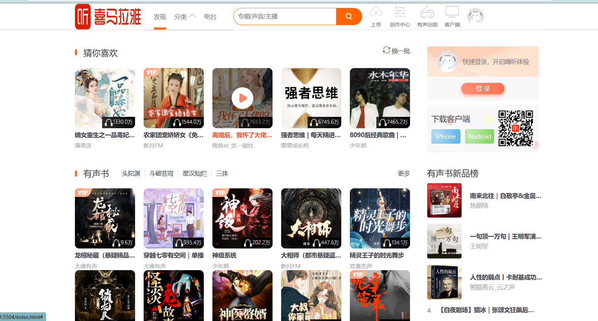
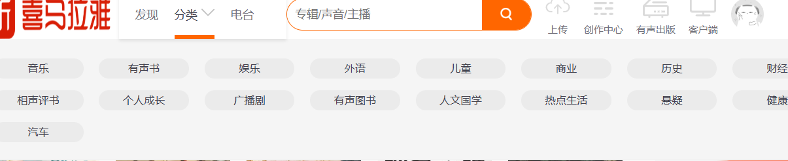
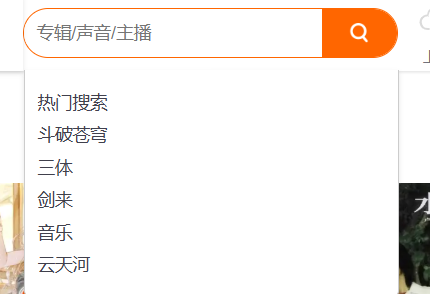
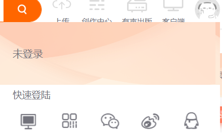

# 一、问题

## 1.提示文本位置太靠上

**问题描述**：提示文本与搜索框的垂直间距过小，影响显示效果。

**解决思路**：调整 `top` 属性：通过设置提示文本容器的 `top` 属性，增加其与搜索框的垂直间距。增加内边距或调整高度：给搜索框容器添加底部内边距，或增加搜索框高度，间接使提示文本位置下移。

## 2.鼠标滑倒上传等图标上是只有一部分变色

**问题描述：**在鼠标滑动到上传等图标时，只有图标的一部分会变色。

**解决思路：**因为一开始使用的是`svg`图片中的`path`标签修改`fill`属性来实现颜色的修改，但最后发现画图时是一个`path`属性对应一条线，最后便用for循环遍历`svg`的所有path属性，并修改`fill`属性。

## 3.滑块不出现问题

**问题描述：**在发现分类电台的滑块设计部分滑块一直不出现或出现但不会移动。

**解决思路：**一开始是打算使用伪元素进行设计，但伪元素会出现难以控制，甚至不出现的情况，最后参照官网添加一个`div`标签，并对`div`标签进行操作得已解决。

## 4.滑块位置不对

**问题描述：**滑块所对应的位置不对，总是会出现在右侧，并且会随页面大小而改变位置，而且鼠标移开后不会回到最开始处。

**解决思路：**最后使用百分比进行位置调整，并添加了一个`slider_mouseleave()`函数，让鼠标离开后初始化滑块。

## 5.分类旁三角形旋转问题

**问题描述：**最开始是想使用图片,但图片的旋转失败。

**解决思路:**最后使用了`css`特殊符号可以简便解决问题。

## 6.`svg`图标的优化

**问题描述：**一开始的上传等模块是打算用`img`标签进行，但修改起来太过麻烦，`svg`修改需要更改每个条形的`fill`属性

**解决思路：**将`img`标签修改成`svg`标签，这样鼠标悬浮时更改颜色就更加简便，再使用一个for循环将`a`标签下的`svg`获取并遍历每个`fill`属性，进行优化。

# 二、成果展示

## 1.整体效果

## 2.分类下拉框及滑块

## 3.搜索栏下拉框

## 4.上传，客户端以及头像的下拉框和变色

## 5.鼠标移动到书上时动画显示及vip标和播放次数

